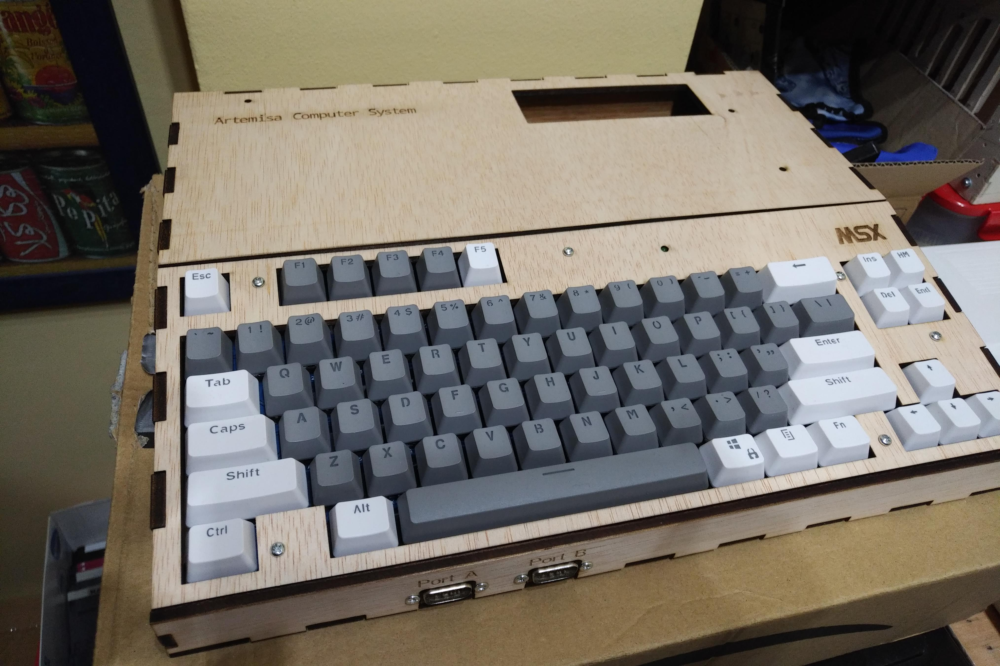

# Artemisa MSX cherry case
Lasercut case for the Artemisa MSX

This is a lasercut design for my Artemisa Home computer (MSX).
I used an Omega cherry mx PCB and so a new PCB keyboard interface.
I've lost the original design but gerbers and jed files are shared here
you can find some more information about Artemisa MSX at: 
https://github.com/artemisamsx/artemisa

